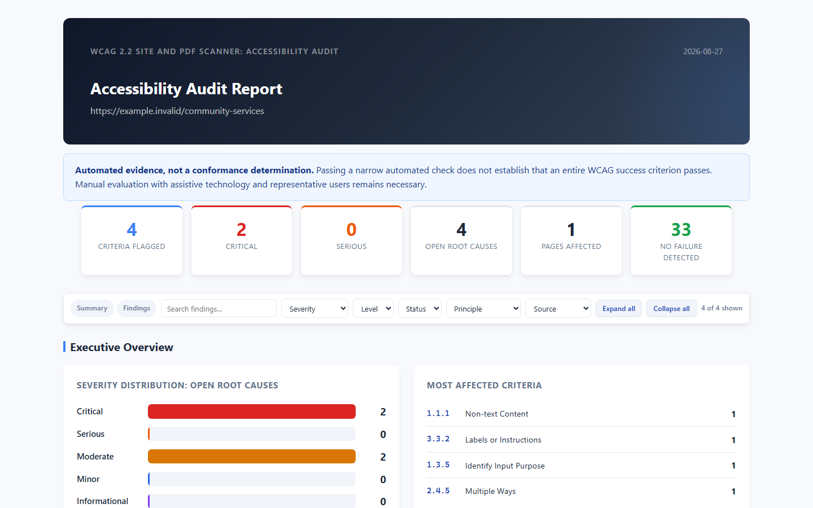

# WCAG 2.2 Site and PDF Scanner

[](https://github.com/fusiontechstrategies/WCAG-2.2-Site-PDF-Scanner/actions/workflows/ci.yml)
[](https://github.com/fusiontechstrategies/WCAG-2.2-Site-PDF-Scanner/actions/workflows/codeql.yml)
[](https://www.python.org/downloads/)
[](https://github.com/fusiontechstrategies/WCAG-2.2-Site-PDF-Scanner/blob/main/LICENSE)

One Python runtime file. Two accessibility surfaces. Evidence you can inspect and defend.

WCAG 2.2 Site and PDF Scanner examines websites, local HTML, and PDF documents through one interactive application. It combines fast source analysis, optional real-browser testing with axe-core, bounded site crawling, conservative PDF structure inspection, PDF discovery, and accessible reports.

The scanner deliberately avoids claiming that automation proves conformance. Every result describes what was tested, what evidence was observed, and where human review is still required.

> Automated testing finds only some accessibility barriers. It does not establish WCAG, Section 508, or PDF/UA conformance. Complete evaluation requires manual review, assistive-technology testing, and judgment about the content and its purpose.

Version 5.0.1 is the current release candidate. Until its GitHub release lists the tested standalone runtime, wheel, normalized source distribution, SPDX SBOM, checksums, release evidence, and provenance, evaluate the source from this repository rather than a similarly named download. See [RELEASING.md](RELEASING.md) for the exact artifact and publication gates.

## See the output first

[](examples/sample-report/report.html)

The preview comes from the production report generator using a deliberately flawed, synthetic page. Download and open the [interactive HTML fixture](examples/sample-report/report.html), inspect its [structured JSON](examples/sample-report/report.json), and review the [input page](examples/sample-site/index.html). The reserved `.invalid` target is never fetched, and no customer or live-scan data is stored in the repository.

## Five-minute local walkthrough

This first run analyzes only the included synthetic HTML file. It does not contact a target website and does not require a Chromium download.

```powershell
git clone https://github.com/fusiontechstrategies/WCAG-2.2-Site-PDF-Scanner.git
cd WCAG-2.2-Site-PDF-Scanner
python -m venv .venv
.venv\Scripts\Activate.ps1
python -m pip install --upgrade pip
python -m pip install -r requirements.txt
python WCAG_Site_PDF_Scanner.py web examples\sample-site\index.html `
  --output-dir a11y_reports `
  --report-formats html,json `
  --no-spell-check
```

On macOS or Linux, use the shell form:

```bash
git clone https://github.com/fusiontechstrategies/WCAG-2.2-Site-PDF-Scanner.git
cd WCAG-2.2-Site-PDF-Scanner
python3 -m venv .venv
source .venv/bin/activate
python -m pip install --upgrade pip
python -m pip install -r requirements.txt
python WCAG_Site_PDF_Scanner.py web examples/sample-site/index.html \
  --output-dir a11y_reports \
  --report-formats html,json \
  --no-spell-check
```

Then open `a11y_reports/report.html` locally.

## Choose a workflow

| Goal | Start here | Important boundary |
|---|---|---|
| Review one public page | `web URL --scope page` | Dynamic checks need Playwright Chromium. |
| Inventory a public site | `web URL --scope site --max-urls 500` | Set a safety cap and use a considerate crawl delay. |
| Inspect local source | `web PATH` | Local files receive static analysis; serve them locally for browser behavior. |
| Inspect PDF evidence | `pdf PATH_OR_URL` | Results are conservative evidence, not PDF/UA certification. |
| Gate a build | Add `--ci-mode` | The command fails on open critical or serious automated findings. |

## Highlights

- One runtime file: `WCAG_Site_PDF_Scanner.py`
- Interactive menu when launched without arguments
- Automation-friendly `web`, `pdf`, `discover-pdfs`, and `diagnostics` commands
- No licensed or hard-coded website page-count ceiling, with an optional operator safety cap
- WCAG 2.2 A, AA, and AAA targeting for web checks
- Static HTML, CSS, accessible-name, spelling, content, and consistency analysis
- Optional Playwright and integrity-verified axe-core browser analysis
- Site, folder, individual page, local file, and local directory scanning
- Local PDF, PDF directory, remote PDF, and URL-list scanning
- Conservative PDF results with explicit manual-review and analysis-error states
- PDF structure, language, title, figures, headings, tables, links, forms, bookmarks, active content, attachments, and PDF/UA metadata evidence
- Bounded sitemap and same-site PDF discovery without scraping search-engine result pages
- HTML, JSON, and spreadsheet-safe CSV output
- Review-first local HTML and CSS remediation with source diffs, backups, rescanning, and rollback
- Built-in offline diagnostics and self-tests

## Security defaults

- Private, loopback, link-local, multicast, reserved, and cloud metadata addresses are blocked by default.
- Redirect destinations are validated.
- Browser subrequests are checked before navigation.
- Browser permissions, service workers, and downloads are disabled for scans.
- HTML, sitemap, URL-list, PDF, and worker-output sizes are bounded.
- Remote PDFs use atomic downloads and must have a valid PDF signature.
- PDF parsing occurs in a child process with a configurable timeout.
- Generated CSV values are neutralized against spreadsheet formula injection.
- The report does not load remote fonts or other presentation assets.
- Remediation refuses templates, links, reparse points, oversized files, out-of-scope paths, and files changed after analysis.

Read [SECURITY.md](SECURITY.md) before scanning untrusted or internal content.

## Requirements

- Python 3.10 through 3.14
- Windows, macOS, or Linux
- Chromium installed through Playwright for dynamic web analysis

## Installation

### Supported source installation

Create and activate a virtual environment from a cloned repository, then install the pinned runtime dependencies:

```powershell
python -m venv .venv
.venv\Scripts\Activate.ps1
python -m pip install --upgrade pip
python -m pip install -r requirements.txt
python -m playwright install chromium
```

On macOS or Linux, activate with `source .venv/bin/activate`.

### Local package and pipx validation

The repository is package-ready for local validation, but neither a 5.0.1 GitHub release nor a public PyPI project has been announced. Do not assume that an unrelated package with a similar name is this project.

Install the current checkout into an active virtual environment:

```powershell
python -m pip install .
wcag-site-pdf-scanner diagnostics
```

Or install a trusted local checkout into a pipx-managed environment:

```powershell
pipx install .
wcag-site-pdf-scanner diagnostics
```

Pipx separates Python package environments; it is not a security sandbox. Review and trust the checkout before installing it because installation and scanner commands run with your user account's privileges.

Both installed forms preserve the original `WCAG_Site_PDF_Scanner.py` module and add the `wcag-site-pdf-scanner` command. The source-file commands in this README remain valid.

The 5.0.1 release path builds exactly six files twice and requires identical bytes: an exact standalone runtime, normalized pure-Python wheel, normalized source distribution, SPDX 2.3 dependency SBOM, SHA-256 checksum file, and commit-bound release evidence. Generated package metadata, archive fields, order, timestamps, ownership, permissions, and line endings are canonicalized for cross-platform reproducibility. A tag pointing to a verified protected-main commit can create only a draft GitHub release. Publication and any future PyPI setup remain separate maintainer decisions.

Optional language analysis uses NLTK data that is never downloaded automatically. Install it explicitly if needed:

```powershell
python -m nltk.downloader punkt cmudict
```

## Interactive use

```powershell
python WCAG_Site_PDF_Scanner.py
```

The menu offers website and local HTML scanning, PDF scanning, PDF discovery, and environment diagnostics.

## Command-line examples

Scan one web page:

```powershell
python WCAG_Site_PDF_Scanner.py web https://example.com --scope page
```

Scan an entire site with bounded discovery:

```powershell
python WCAG_Site_PDF_Scanner.py web https://example.com --scope site --max-urls 500
```

Omit `--max-urls` when you do not want an artificial page-count ceiling. Real capacity still depends on time, memory, storage, the target site's behavior, and crawl exclusions. For unattended or production use, an explicit safety cap is strongly recommended.

Scan a local HTML project:

```powershell
python WCAG_Site_PDF_Scanner.py web C:\path\to\site --report-formats html,json,csv
```

Scan one or more local PDFs:

```powershell
python WCAG_Site_PDF_Scanner.py pdf C:\documents\one.pdf C:\documents\two.pdf
```

Scan every PDF under a directory:

```powershell
python WCAG_Site_PDF_Scanner.py pdf C:\documents --workers 4
```

Scan remote PDFs or a text file containing one URL per line:

```powershell
python WCAG_Site_PDF_Scanner.py pdf https://example.com/document.pdf
python WCAG_Site_PDF_Scanner.py pdf --url-file pdf-urls.txt
```

Discover PDFs from sitemaps and same-site pages:

```powershell
python WCAG_Site_PDF_Scanner.py discover-pdfs https://example.com --output pdf-urls.txt
```

Discover and immediately scan them:

```powershell
python WCAG_Site_PDF_Scanner.py discover-pdfs https://example.com --scan --report-dir accessibility_reports
```

Run offline diagnostics and self-tests:

```powershell
python WCAG_Site_PDF_Scanner.py diagnostics
```

## Interactive remediation

Guided remediation is available for local HTML and linked CSS source:

```powershell
python WCAG_Site_PDF_Scanner.py web C:\path\to\site --fix
```

The remediation workflow can currently guide or propose changes for image alternatives, document language, skip links, page titles, form autocomplete, form labels, iframe titles, and suppressed CSS focus outlines. Each source edit is handled as follows:

1. The exact local target is validated against the scanned directory.
2. Template files, symbolic links, hard links, Windows reparse points, non-UTF-8 content, and oversized files are refused.
3. HTML attribute edits preserve the surrounding source instead of reformatting the full document.
4. A bounded unified diff is displayed before any write.
5. The user approves the transaction explicitly.
6. A unique rollback backup is created and the replacement is atomic.
7. Changed files are rescanned with the applicable narrow automated engine.
8. The user keeps the transaction or restores every backup.
9. Retained changes and SHA-256 digests are recorded in the JSON audit trail.

Remote websites are never edited. PDF results provide evidence and remediation guidance, but the tool does not attempt general-purpose automatic PDF retagging. Human review remains required even when a follow-up automated check no longer reports the original finding.

The legacy convenience form remains available. The application determines whether the target is web/HTML or PDF:

```powershell
python WCAG_Site_PDF_Scanner.py https://example.com
python WCAG_Site_PDF_Scanner.py C:\documents\example.pdf
```

## Result language

PDF evidence uses these outcomes:

| Status | Meaning |
|---|---|
| `Fail` | The narrow automated rule found evidence of a failure. |
| `Pass (narrow automated test)` | The rule ran and found no corresponding failure. This is not full success-criterion conformance. |
| `Needs manual review` | Automation found relevant evidence but cannot determine the outcome. |
| `Not applicable` | The tested feature was not detected. |
| `Not tested` | Required structure or capability was unavailable. |
| `Analysis error` | The check could not complete. Never interpret this as a pass or as not applicable. |

Web reports likewise treat successful checks as narrow evidence. If a finding contradicts a pass record for the same criterion and location, the pass record is suppressed.

## Reports

Web scans support:

- Interactive HTML
- JSON
- CSV
- Markdown
- PDF summary
- JUnit XML

PDF scans support:

- Self-contained HTML
- JSON with structured evidence
- Spreadsheet-safe CSV with one row per rule result

Reports may contain page text, element markup, URLs, file paths, and screenshots. Treat them according to the sensitivity of the scanned content.

## Standards and guidance

The implementation is informed by:

- [Web Content Accessibility Guidelines 2.2](https://www.w3.org/TR/WCAG22/)
- [W3C guidance for applying WCAG to non-web documents](https://www.w3.org/WAI/standards-guidelines/wcag/non-web-ict/)
- [W3C guidance on Accessibility Conformance Testing rules](https://www.w3.org/WAI/WCAG22/Understanding/understanding-act-rules)
- [US Section 508 PDF guidance](https://www.section508.gov/create/pdfs/)
- [PDF Association Matterhorn Protocol](https://pdfa.org/resource/the-matterhorn-protocol/)

The scanner is not a certified PDF/UA validator and does not replace a complete accessibility audit.

## Responsible use

Scan only systems and documents you own or are authorized to test. Use conservative concurrency and crawl delays on shared systems. Private-network scanning requires the explicit `--allow-private-hosts` option.

## Development

The production runtime remains in one Python module. Focused regression tests, examples, and release checks are kept in separate support files.

See [CONTRIBUTING.md](CONTRIBUTING.md), [RELEASING.md](RELEASING.md), [SECURITY.md](SECURITY.md), [TESTING.md](TESTING.md), and [THIRD_PARTY_NOTICES.md](THIRD_PARTY_NOTICES.md).

## License

MIT License. See [LICENSE](LICENSE).

This project is independent and is not affiliated with or endorsed by W3C, the US General Services Administration, PDF Association, Deque Systems, Microsoft, or the publishers of referenced accessibility tools.
